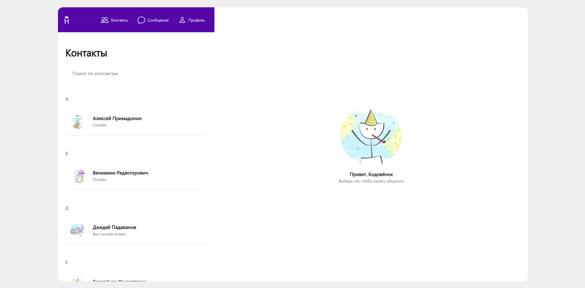
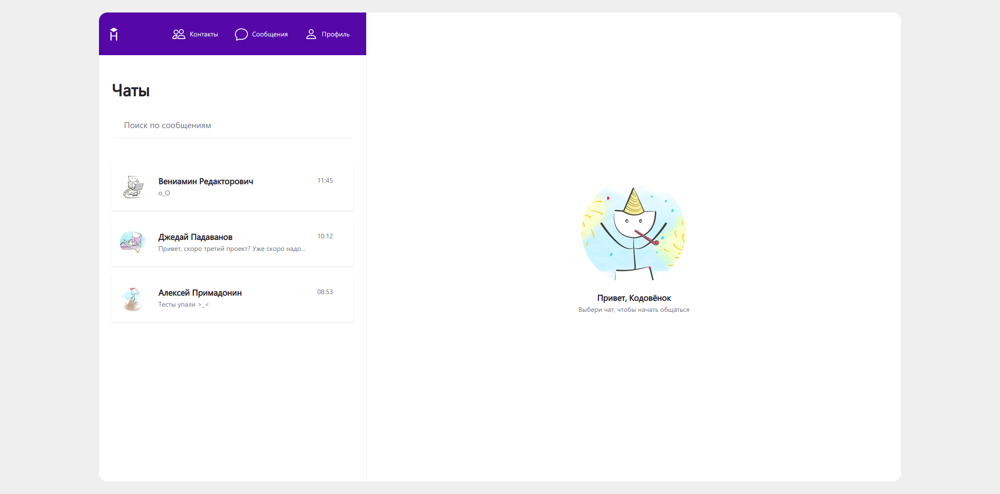
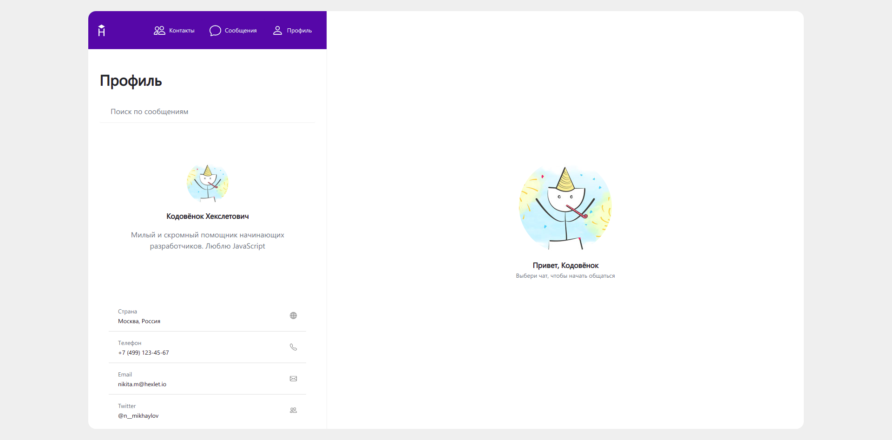
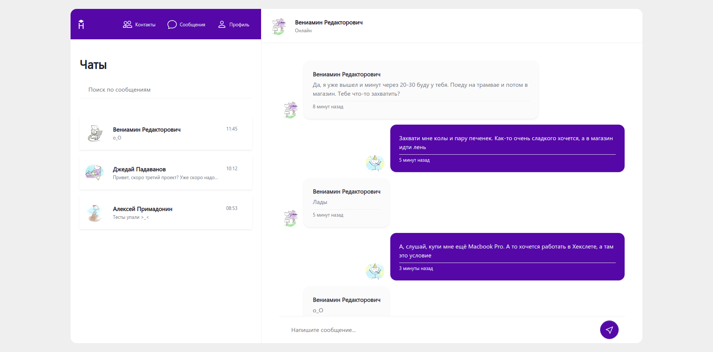
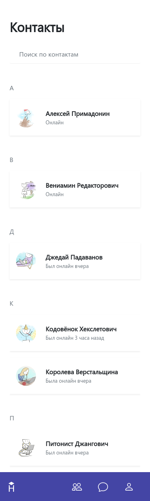
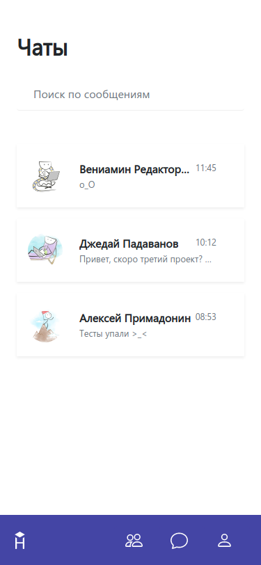
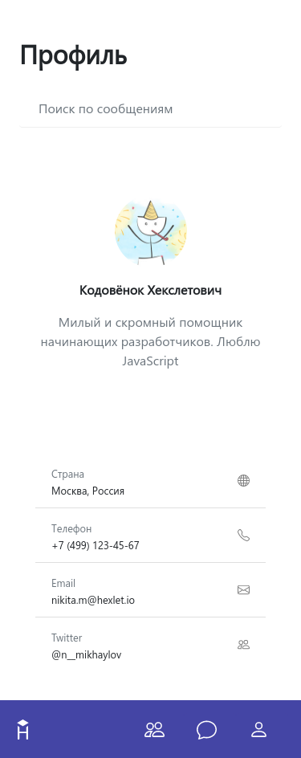
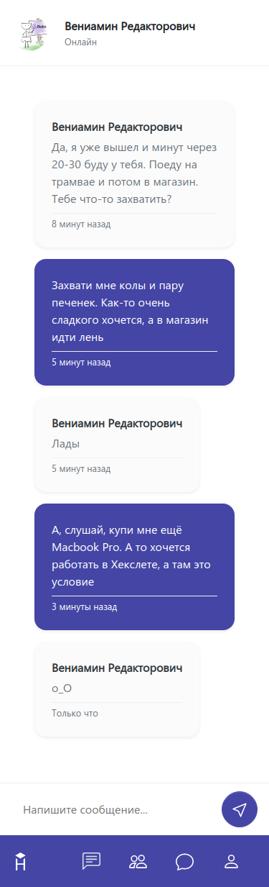

# Hexlet Chat

* **[README на русском](./README.ru-RU.md)**

Layout design for "Hexlet Chat". Contains two pages: "[Home](https://viler-hexletchat.surge.sh/)" and "[Chat](https://viler-hexletchat.surge.sh/chat.html)".

Technologies used: [SCSS](https://sass-lang.com/), [Pug](https://pugjs.org/), [Gulp](https://gulpjs.com/).

## Preview

### Contacts tab (Desktop)

### Chats tab (Desktop)

### Profile tab (Desktop)

### Current chat (Desktop)

### Contacts tab (Mobile)

### Chats tab (Mobile)

### Profile tab (Mobile)

### Current chat (Mobile)

