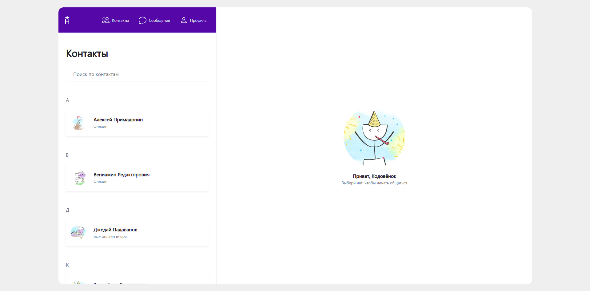
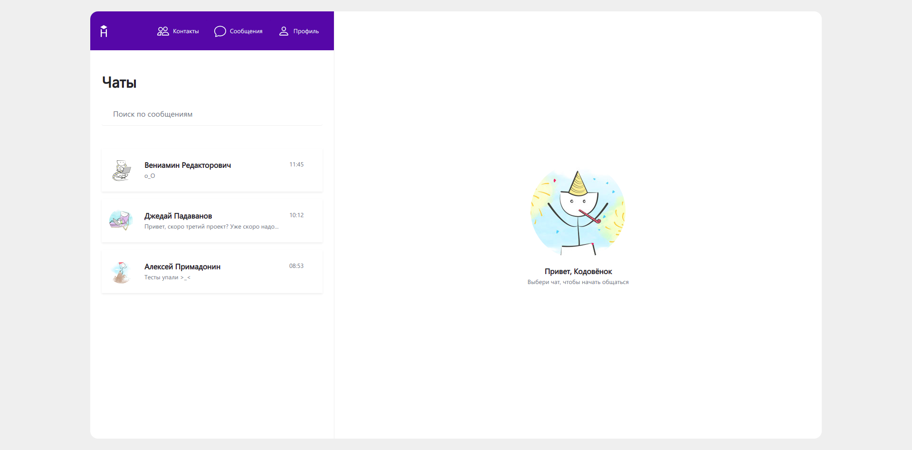
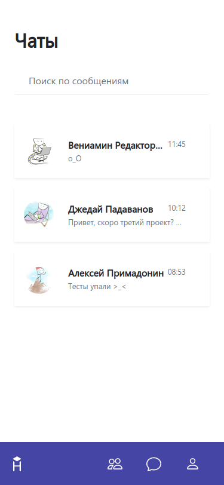
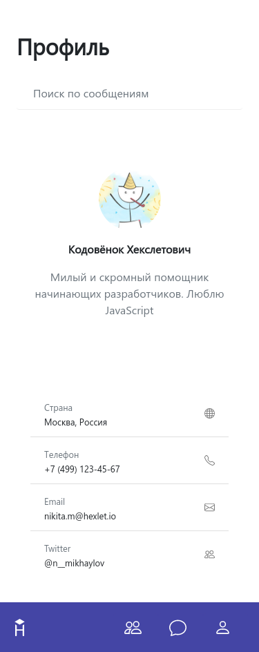
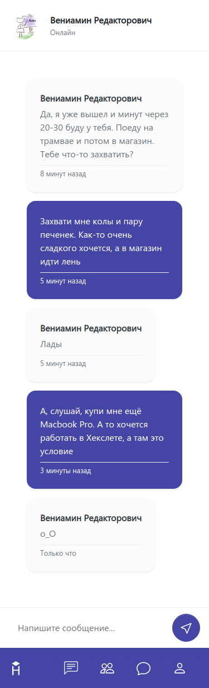

# Hexlet Chat

Вёрстка для "Hexlet Chat". Состоит из двух страниц: "[Главная](https://viler-hexlet-chat.surge.sh/)" and "[Чат](https://viler-hexlet-chat.surge.sh/chat.html)".

Использованные технологии: [SCSS](https://sass-lang.com/), [Pug](https://pugjs.org/), [Gulp](https://gulpjs.com/).

## Превью

### Вкладка контактов (Десктоп)

### Вкладка чатов (Десктоп)

### Вкладка профиля (Десктоп)

### Текущий чат (Десктоп)

### Вкладка контактов (Мобильные устройства)

### Вкладка чатов (Мобильные устройства)

### Вкладка профиля (Мобильные устройства)

### Текущий чат (Мобильные устройства)

